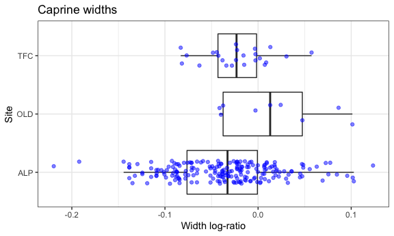
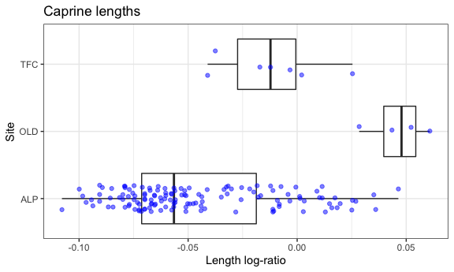
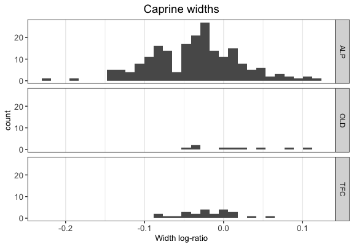
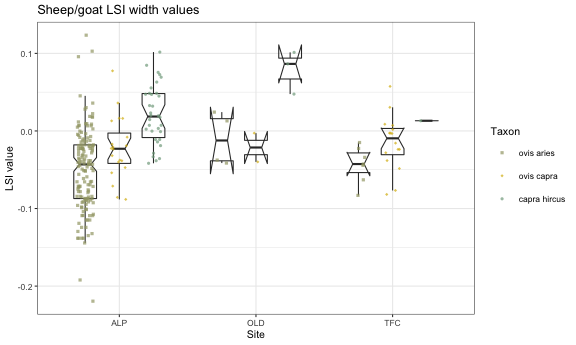
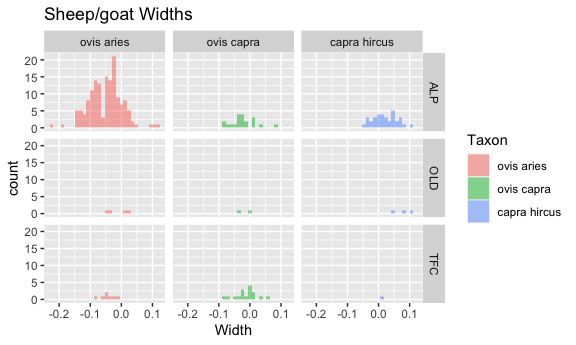
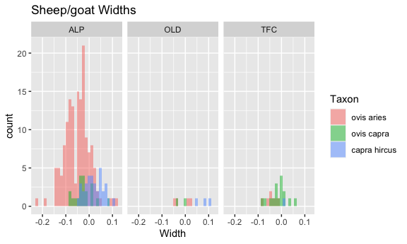

Package ***zoolog***:  
Zooarcheological Analysis with Log-Ratios.
================
Jose M Pozo, Silvia Valenzuela-Lamas, Angela Trentacoste, Ariadna
Nieto-Espinet and Silvia Guimarães Chiarelli
2021-01-17

# Introduction

The package ***zoolog*** includes functions and reference data to
generate and manipulate log-ratios (also known as log size index (LSI)
values) from measurements obtained on zooarchaeological material. Log
ratios are used to compare the relative (rather than the absolute)
dimensions of animals from archaeological contexts (Meadow 1999).
Essentially, the method compares archaeological measurements to a
standard, producing a value that indicates how much larger or smaller
the archaeological specimen is compared to that standard.

The methods included in the package were first developed in the
framework of the ERC-Starting Grant 716298 ZooMWest (PI S.
Valenzuela-Lamas), and were first used in the paper (Trentacoste,
Nieto-Espinet, and Valenzuela-Lamas 2018). They are based on the
techniques proposed by (Simpson 1941) and (Simpson, Roe, and Lewontin
1960), which calculates LSI values as such:

LSI (log size index) = (log x - log m) = log(x/m)

The zoolog package is based on the measurements and measurement
abbreviations defined in (Von den Driesch 1976) and (Davis 1992).
Several different sets of standard reference values for calculating the
log ratios are included in the package. These standards include several
published and widely used biometric datasets (i.e. (Davis 1996),
(Albarella and Payne 2005)) as well as other less known standards. We
are particularly grateful to Sabine Deschler-Erb and Barbara Stopp, from
the University of Basel (Switzerland) for making the reference values of
several specimens available through the ICAZ Roman Period Working Group,
which have been included here with their permission.

In general, zooarcheological datasets are composed of skeletal remains
representing many different anatomical body parts. In investigation of
animal size, the analysis of measurements from a given anatomical
element provides the best control for the variables affecting size and
shape and, as such, it is the preferable option. Unfortunately, this
approach is not always viable due to low sample sizes in some
archaeological assemblages. This problem can be mitigated by calculating
the LSI values for measurements with respect to a reference, which
provides a means of aggregating biometric information from different
body parts. The resulting log ratios can be compared and statistically
analysed under reasonable conditions (Albarella 2002). However, length
and width measurements of different anatomical elements still should not
be directly compared or aggregated for statistical analysis.

The package includes a Thesaurus to facilitate its usage by research
teams across the globe, and working in different languages and with
different recording traditions. The Thesaurus enables the *zoolog*
package to recognises many different names for taxa and skeletal
elements (e.g. ‘Bos taurus’, ‘Bos’, ‘BT’, ‘bovino’, ‘bota’).
Consequently, there is no need to use a particular, standardised
recording code for the names of different taxa or elements. This first
version of has benefited from the contributions from Moussab Besso,
Canan Cakirlar, Jwana Chahoud, Jacopo De Grossi Mazzorin, Sabine
Deschler-Erb, Dimitrios Filioglou, Armelle Gardeisen, Sierra Harding,
Pilar Iborra, Michael MacKinnon, Nimrod Marom, Claudia Minniti,
Francesca Slim, Barbara Stopp, and Emmanuelle Vila. We are grateful to
them for their comments and help. In addition, users are encouraged to
contribute to the Thesaurus so it can be expanded and adapted to any
database.

## Installation

You can install the released version of zoolog from
[CRAN](https://CRAN.R-project.org) with:

``` r
install.packages("zoolog")
```

And the development version from [GitHub](https://github.com/) with:

``` r
install.packages("devtools")
devtools::install_github("josempozo/zoolog")
```

# Reference

The log-ratios are calculated with respect to a standard reference. The
package **zoolog** includes three reference datasets. In addition, the
user can consider other references, or the provided references can be
extended and updated integrating newer research data. Submission of
extended/improved references is encouraged. Please, contact the
mantainer through the provided email address so the new reference is
fully accessible and your name added to the list of contributors.

The references are provided as dataframes named
`ReferenceNietoAlbarellaDavis`, `ReferenceBasel`, and `ReferenceCombi`.
They include reference values for the main domesticates and red deer:
*Bos taurus*, *Ovis aries*, *Capra hircus*, *Sus domesticus*, and
*Cervus elaphus*:

  - **ReferenceNietoDavisAlbarella** Includes the measurements from a
    female cow from Late Neolithic Minferri in Catalonia (Nieto-Espinet
    2018), the mean values of the adult female Shetland sheep
    measurements described in (Davis 1996), and the pig measurements
    from (Albarella and Payne 2005).

  - **ReferenceBasel** Includes the measurements compiled by Barbara
    Stopp from the reference collection in the Integrative
    Prähistorische und Naturwissenschaftliche Archäologie (IPNA,
    University of Basel, Switzerland). The specimens included are: *Bos
    taurus* Inv.nr. 2426 (Hinterwälder; female; 17 years old; live
    weight: 340 kg; withers height: 113 cm), *Ovis musimon* Inv.nr. 2266
    (Male; adult), *Capra hircus* Inv.nr. 1597 (Male; adult), *Sus
    scrofa* Inv.nr. 1446 (male; 2-3 years old; life weight: 120 kg),
    *Cervus elaphus* Inv.nr. 2271 (male; adult).

  - **ReferenceCombi** Includes the most comprehensive reference for
    each species so more measurements can be considered: the Late
    Neolithic female cow from Minferri site in present-day Catalonia
    (Nieto-Espinet 2018), the mean measurements from the Male Soay sheep
    (of known age) and mean measurements from male/female goats (age
    unknown) from (Clutton-Brock et al. 1990), the pig measurements from
    Inv.nr. 1446 (male; 2-3 years old; life weight: 120 kg) from
    IPNA-Basel, and the red deer measurements from Inv.nr.2271 at
    IPNA-Basel registered by Barbara Stopp.

The details of the reference data are described in .

# Functions

The full list of functions is available under the ‘Help’ page of zoolog.
Here we present the three main ones and describe their use:

  - **`LogRatios`** This function computes the log ratios of the
    measurements relative to standard reference values. Three references
    are provided with the package. By default the ‘ReferenceCombi’ is
    used, as it is the most comprehensive so far. The function includes
    the option to ‘joinCategories’ allowing several taxa (typically
    Ovis, Capra, and unknown Ovis/Capra) to be considered together.

  - **`RemoveNACases`** This function removes the table rows for which
    all measurements of interest are non-available (NA). A particular
    list of measurement names can be explicitly provided or selected by
    a common initial pattern (e.g. prefix). The default setting removes
    the rows with no available log ratios to facilitate subsequent
    analysis of the data.

  - **`CondenseLogs`** This function condenses the calculated log ratio
    values into a reduced number of features by grouping log ratio
    values and selecting or calculating a feature value. By default the
    selected groups represent a single dimension, i.e. `Length` and
    `Width`. Only one feature is extracted per group. Currently, two
    methods are possible: “priority” (default) or “average”. This
    operation is motivated by two circumstances. First, not all
    measurements are available for every bone specimen, which obstructs
    their direct comparison and statistical analysis. Second, several
    measurements can be strongly correlated (e.g. SD and Bd both
    represent bone width). Thus, considering them as independent would
    produce an over-representation of bone remains with multiple
    measurements per axis. Condensing each group of measurements into a
    single feature (e.g. one measure per axis) alleviates both problems.
    The default method (“priority”), selects the first available log
    ratio in each group. We provide the following by-default group and
    prioritization: For lengths, the first option is GL, then HTC. For
    widths, the order of priority is: Bd, BT, Bp, SD. This order
    maximises the robustness and reliability of the measurements, as
    priority is given to the most abundant, more replicable, and less
    age dependent measurements.The method ‘average’ extracts the mean
    per group, ignoring the non-available log ratios.

# Thesaurus

A thesaurus set is defined in order to make the methods robust to
different nomenclatures used in datasets created by different authors
and in different languages. The user can also use other thesaurus sets,
or can modify the provided one. In this latter case, please, contact the
maintainer at the provided email address so we can include the additions
to the new versions of the package. Your name will be added to the list
of contributors, as you will help to make the package more robust and
comprehensive.

So far, four thesauri are included in **zoolog**:

  - **`identifierThesaurus`** refers to the column names that will be
    considered to calculate the log ratios. So far, it includes the
    categories ‘Taxon’, ‘Element’, ‘Measure’, and ‘Standard’. Each of
    these categories has different options (e.g.: ‘Taxon’ includes
    Taxon, TAX, species, animal, Specie, GenusSpecies, Especie, see
    below). This enables the `LogRatios` function to recognise the
    relevant column and compute the log ratios regardless of its name as
    long as it is included in the relevant Thesaurus (`taxonThesaurus`,
    `elementThesaurus`, `measureThesaurus`).

  - **`taxonThesaurus`** refers to the various possibilities for naming
    taxa when recording animal bones. This enables the `LogRatios`
    function to recognise the name of each species and to find the
    relevant biometrical reference no matter what it is called in the
    database and the reference file (e.g. if in the user database, ‘BT’
    refers to Bos taurus, but this is written ‘bota’ in the
    osteometrical reference). The `LogRatios` function correctly matches
    these terms because both categories (‘BT’ and ‘bota’) are included
    in the ‘Bos taurus’ category of the `taxonThesaurus`. To facilitate
    the comparison of names, the function has been made case,
    punctuation and spacing insensitive by default (‘Bos’ is considered
    same as ‘bos’ and ‘Bos.’).You can see the categories currently
    included as follows:

<!-- end list -->

``` r
library(zoolog)
thesaurusFile <- system.file("extdata", "taxonThesaurus.csv", package="zoolog")
thesaurusTax <- ReadThesaurus(thesaurusFile)
thesaurusTax
#>              bos taurus         ovis aries capra hircus             ovis capra
#> 1            bos taurus         ovis aries capra hircus             ovis capra
#> 2                  bota               ovar         cahi                     oc
#> 3                   bos               ovis        capra                caprine
#> 4                cattle              sheep         goat             ovis/capra
#> 5                    BT                 OA           CH                    s/g
#> 6                bovino              oveja        cabra             sheep/goat
#> 7  Grands Bovides Boeuf Ovicaprines Mouton       pecora                   Sh/G
#> 8                  vaca                 ov        cabra             ovicaprino
#> 9                     B             ovella          CAH                    O/C
#> 10                                     OVA              Ovicaprines Ovis-Capra
#> 11                                                                    ovicapri
#> 12                                                                           O
#>    sus domesticus cervus elaphus
#> 1  sus domesticus cervus elaphus
#> 2            sudo           ceel
#> 3             sus         cervus
#> 4             pig       red deer
#> 5              SS             CE
#> 6           cerdo         ciervo
#> 7     Suides Porc  Cervides Cerf
#> 8            porc            CEE
#> 9                         cervol
#> 10                        ciervo
#> 11                              
#> 12
```

  - **`elementThesaurus`** refers to the various possibilities for
    naming anatomical elements when recording animal bones. This enables
    the `LogRatios` function to recognise the name of each element and
    to find the relevant biometrical reference regardless of what it is
    called in the database and the reference file (e.g. if in the user
    database, ‘omero’ refers to humerus, but this is written ‘HU’ in the
    osteometrical reference). The `LogRatios` function correctly matches
    these terms because both categories (‘omero’ and ‘HU’) are included
    in the ‘humerus’ category of the `elementThesaurus`. To facilitate
    the comparison of names, the function has been made case, quotation
    and spacing insensitive by default (‘Hum’ is considered same as
    ‘hum’ and ‘Hum.’). You can see the categories currently included
    as follows:

<!-- end list -->

``` r
thesaurusFile <- system.file("extdata", "elementThesaurus.csv", package="zoolog")
thesaurusEL <- ReadThesaurus(thesaurusFile)
thesaurusEL
#>    scapula                  humerus                  radius      metacarpus
#> 1  scapula                  humerus                  radius      metacarpus
#> 2       SC                       HU                      RA              MC
#> 3  scapula                      hum                     rad           metac
#> 4  scapola                  Humerus                    radi             MC1
#> 5      esc                    humer                   radio             MC2
#> 6    scap.                    omero Membre-anterieur radius        metacarp
#> 7   escap. Membre-anterieur humerus                               metacarpo
#> 8                                                           Metacarpe Canon
#> 9                                                                metacarpal
#> 10                                                                         
#> 11                                                                         
#> 12                                                                         
#>    metacarpus III metacarpus IV     pelvis                   femur
#> 1  metacarpus III metacarpus IV     pelvis                   femur
#> 2  metacarpal III metacarpal IV         PE                      FE
#> 3          MC III         MC IV      coxal                     fem
#> 4      metac. III     metac. IV        cox                  femore
#> 5             MC3           MC4 innominate Membre-posterieur Femur
#> 6                                                                 
#> 7                                                                 
#> 8                                                                 
#> 9                                                                 
#> 10                                                                
#> 11                                                                
#> 12                                                                
#>                      tibia       calcaneum  astragalus      metatarsus
#> 1                    tibia       calcaneum  astragalus      metatarsus
#> 2                       TI             CAL          AS              MT
#> 3                      TIB           calca       talus           metat
#> 4  Membre-posterieur tibia         Calcani         AST             MT1
#> 5                                   calcan   astragalo             MT2
#> 6                                 calcagno      astrag        metatars
#> 7                          Tarse calcaneum Tarse Talus       metatarso
#> 8                                Calcaneus             Metatarse Canon
#> 9                                       CA                  metatarsal
#> 10                                                                    
#> 11                                                                    
#> 12                                                                    
#>    metatarsus III metatarsus IV anterior first phalanx first phalanx
#> 1  metatarsus III metatarsus IV anterior first phalanx first phalanx
#> 2  metatarsal III metatarsal IV         Phalange 1 ant    Phalange 1
#> 3          MT III         MT IV         Phalanx 1 ant.     Phalanx 1
#> 4      metat. III     metat. IV                 P1 ant            P1
#> 5             MT3           MT4          falange 1 ant     falange 1
#> 6                                                 PH1A           PH1
#> 7                                           phal 1 ant        phal 1
#> 8                                  Phalange I anterior    Phalange I
#> 9                                             fal1 ant          fal1
#> 10                                            ant 1fal          1fal
#> 11                                           ant fal 1         fal 1
#> 12                                           1 fal ant         1 fal
#>    posterior first phalanx anterior second phalanx second phalanx
#> 1  posterior first phalanx anterior second phalanx second phalanx
#> 2          Phalange 1 post          Phalange 2 ant     Phalange 2
#> 3          Phalanx 1 post.          Phalanx 2 ant.      Phalanx 2
#> 4                  P1 post                  P2 ant             P2
#> 5           falange 1 post           falange 2 ant      falange 2
#> 6                     PH1P                    PH2A            PH2
#> 7              phal 1 post              phal 2 ant         phal 2
#> 8          Phalange I post    Phalange II anterior    Phalange II
#> 9                fal1 post                fal2 ant          fal 2
#> 10               post 1fal                ant 2fal           2fal
#> 11              post fal 1               ant fal 2          fal 2
#> 12              1 fal post               2 fal ant          2 fal
#>    posterior second phalanx
#> 1  posterior second phalanx
#> 2           Phalange 2 post
#> 3           Phalanx 2 post.
#> 4                   P2 post
#> 5            falange 2 post
#> 6                      PH2P
#> 7               phal 2 post
#> 8     Phalange II posterior
#> 9                fal 2 post
#> 10                post 2fal
#> 11               post fal 2
#> 12               2 fal post
```

  - **`measureThesaurus`** refers to the various possibilities for
    naming measurements. In general, the English abbreviations from (Von
    den Driesch 1976) and (Davis 1992) are widely used. But this enables
    other nomenclatures (e.g. original German abbreviations in (Von den
    Driesch 1976)) to be included, or several measurements to be nested
    under the same category. In this case, GLl is considered as GL.

# Examples

## Reading data and calculating log ratios

This example reads a dataset from a file in csv format and computes the
log-ratios. Then, the cases with no available log-ratios are removed.
Finally, the resulting dataset is saved in a file in csv format.

The first step is to set the local path to the folder where you have the
dataset to be analysed (this is typically a comma-separated value (csv)
file). Here the example dataset from (Valenzuela-Lamas 2008) included in
the package is used:

``` r
library(zoolog)
dataFile <- system.file("extdata", "dataValenzuelaLamas2008.csv.gz", 
                        package = "zoolog")
data = read.csv2(dataFile,
                 quote="\"", header=TRUE, na="",
                 fileEncoding="UTF-8")
```

We now calculate the log-ratios using the function `LogRatios`. Only
measurements that have an associated standard will be included in this
calculation. The log values will appear as new columns with the prefix
‘log’ following the original columns with the raw measurements:

``` r
dataWithLog=LogRatios(data)
head(dataWithLog)[,-c(6:20,32:63)]
#>   Site N.inv    UE Especie    Os   GL   Bp   Dp   SD   DD   Bd   Dd BT GLc BFd
#> 1  ALP  3629  8427    avif 1 fal   NA   NA   NA   NA   NA   NA   NA NA  NA  NA
#> 2  ALP  4918 10364    bota 1 fal 54.0 31.3 30.6 28.1 26.3 27.5 20.0 NA  NA  NA
#> 3  ALP  4919 10364    bota 1 fal 54.5 27.9 31.8 26.0 22.8 25.3 19.5 NA  NA  NA
#> 4  ALP  2211  7105    bota 1 fal 47.6 25.2 25.2 20.6 23.7 17.8   NA NA  NA  NA
#> 5  ALP  1257  7093    bota 1 fal 51.1 24.1  2.7 21.5 17.0   NA   NA NA  NA  NA
#> 6  ALP  4693 10258      oc 1 fal 31.0 10.7 12.4   NA  7.4  8.9  8.0 NA  NA  NA
#>   Dl HmandM3 logBd logBFd logBG logBp logBPC logBT logDd logDl logDp logDPA
#> 1 NA      NA    NA     NA    NA    NA     NA    NA    NA    NA    NA     NA
#> 2 NA      NA    NA     NA    NA    NA     NA    NA    NA    NA    NA     NA
#> 3 NA      NA    NA     NA    NA    NA     NA    NA    NA    NA    NA     NA
#> 4 NA      NA    NA     NA    NA    NA     NA    NA    NA    NA    NA     NA
#> 5 NA      NA    NA     NA    NA    NA     NA    NA    NA    NA    NA     NA
#> 6 NA      NA    NA     NA    NA    NA     NA    NA    NA    NA    NA     NA
#>   logGB logGL logGLc logGLP logH logL logLA logLAR logLG logSD logSH logSLC
#> 1    NA    NA     NA     NA   NA   NA    NA     NA    NA    NA    NA     NA
#> 2    NA    NA     NA     NA   NA   NA    NA     NA    NA    NA    NA     NA
#> 3    NA    NA     NA     NA   NA   NA    NA     NA    NA    NA    NA     NA
#> 4    NA    NA     NA     NA   NA   NA    NA     NA    NA    NA    NA     NA
#> 5    NA    NA     NA     NA   NA   NA    NA     NA    NA    NA    NA     NA
#> 6    NA    NA     NA     NA   NA   NA    NA     NA    NA    NA    NA     NA
```

We could be interested in obtaining the log ratios of all caprine,
including *ovis aries*, *capra hircus*, and *ovis capra*, with respect
to the reference for *ovis aries*. This can be set using the argument
`joinCategories`.

``` r
categories <- list(ovar = c("sheep", "capra", "oc"))
dataWithLog=LogRatios(data, joinCategories = categories)
head(dataWithLog)[,-c(6:20,32:63)]
#>   Site N.inv    UE Especie    Os   GL   Bp   Dp   SD   DD   Bd   Dd BT GLc BFd
#> 1  ALP  3629  8427    avif 1 fal   NA   NA   NA   NA   NA   NA   NA NA  NA  NA
#> 2  ALP  4918 10364    bota 1 fal 54.0 31.3 30.6 28.1 26.3 27.5 20.0 NA  NA  NA
#> 3  ALP  4919 10364    bota 1 fal 54.5 27.9 31.8 26.0 22.8 25.3 19.5 NA  NA  NA
#> 4  ALP  2211  7105    bota 1 fal 47.6 25.2 25.2 20.6 23.7 17.8   NA NA  NA  NA
#> 5  ALP  1257  7093    bota 1 fal 51.1 24.1  2.7 21.5 17.0   NA   NA NA  NA  NA
#> 6  ALP  4693 10258      oc 1 fal 31.0 10.7 12.4   NA  7.4  8.9  8.0 NA  NA  NA
#>   Dl HmandM3 logBd logBFd logBG logBp logBPC logBT logDd logDl logDp logDPA
#> 1 NA      NA    NA     NA    NA    NA     NA    NA    NA    NA    NA     NA
#> 2 NA      NA    NA     NA    NA    NA     NA    NA    NA    NA    NA     NA
#> 3 NA      NA    NA     NA    NA    NA     NA    NA    NA    NA    NA     NA
#> 4 NA      NA    NA     NA    NA    NA     NA    NA    NA    NA    NA     NA
#> 5 NA      NA    NA     NA    NA    NA     NA    NA    NA    NA    NA     NA
#> 6 NA      NA    NA     NA    NA    NA     NA    NA    NA    NA    NA     NA
#>   logGB logGL logGLc logGLP logH logL logLA logLAR logLG logSD logSH logSLC
#> 1    NA    NA     NA     NA   NA   NA    NA     NA    NA    NA    NA     NA
#> 2    NA    NA     NA     NA   NA   NA    NA     NA    NA    NA    NA     NA
#> 3    NA    NA     NA     NA   NA   NA    NA     NA    NA    NA    NA     NA
#> 4    NA    NA     NA     NA   NA   NA    NA     NA    NA    NA    NA     NA
#> 5    NA    NA     NA     NA   NA   NA    NA     NA    NA    NA    NA     NA
#> 6    NA    NA     NA     NA   NA   NA    NA     NA    NA    NA    NA     NA
```

Note that this option does not remove the distinction in the data
between the different species, it just indicates that for these taxa the
log ratios must be computed from the same reference (`ovar`).

The cases without log-ratios can be removed to facilitate subsequent
analyses:

``` r
dataWithLogPruned=RemoveNACases(dataWithLog)
```

You may want to write the resulting file in the working directory (you
need to set it first):

``` r
write.csv2(dataWithLogPruned, "myDataWithLogValues.csv", 
            quote=FALSE, row.names=FALSE, na="", 
            fileEncoding="UTF-8")
```

## Condensing log values

After calculating log ratios using the `LogRatios` function, many rows
in the resultant dataframe (dataWithLog in the example above) may
contain multiple log values, i.e. you will have several log values
associated with a particular archaeological specimen. When analysing log
ratios, it is preferential to avoid overrepresentation of bones with a
greater number of measurements and account for each specimen only once.
The `CondenseLogs` function extracts one length and one width value from
each row and places these in new Length and Width columns.The ‘priority’
method described in (Trentacoste, Nieto-Espinet, and Valenzuela-Lamas
2018) has been set as default. Nevertheless, other options (e.g. average
of all width log values for a given specimen) can be chosen if
preferred. In this case, the default option has been used:

``` r
dataWithSummary <- CondenseLogs(dataWithLogPruned)
head(dataWithSummary)[, -c(6:20,32:63)]
#>   Site N.inv    UE Especie       Os   GL   Bp   Dp   SD   DD   Bd  Dd BT GLc
#> 1  ALP   455 10026    sudo     1fal 33.3 15.7 16.1   NA 12.3 14.5 9.6 NA  NA
#> 2  ALP  2639  8351    sudo     1fal 34.4 16.4 16.6 13.6 15.7 10.8  NA NA  NA
#> 3  ALP  1092 10283    sudo     1fal 35.8 15.9 16.2 12.2 14.0 10.8  NA NA  NA
#> 4  ALP  3453 10410    ovar 1fal ant 27.1  9.9 12.3 17.9  9.0  9.0  NA NA  NA
#> 5  ALP  3455 10410    ovar 1fal ant 27.6  9.6 12.2  7.6  8.9  8.3  NA NA  NA
#> 6  ALP  3524 10122    ovar 1fal ant 27.7  9.2 11.5  7.5  9.4  8.1  NA NA  NA
#>   BFd Dl HmandM3       logBd logBFd logBG       logBp logBPC logBT logDd logDl
#> 1  NA NA      NA          NA     NA    NA -0.07501199     NA    NA    NA    NA
#> 2  NA NA      NA          NA     NA    NA -0.05606779     NA    NA    NA    NA
#> 3  NA NA      NA          NA     NA    NA -0.06951452     NA    NA    NA    NA
#> 4  NA NA      NA -0.08911977     NA    NA -0.07991177     NA    NA    NA    NA
#> 5  NA NA      NA -0.12428419     NA    NA -0.09327573     NA    NA    NA    NA
#> 6  NA NA      NA -0.13487726     NA    NA -0.11175913     NA    NA    NA    NA
#>         logDp logDPA logGB       logGL logGLc logGLP logH logL logLA logLAR
#> 1          NA     NA    NA          NA     NA     NA   NA   NA    NA     NA
#> 2          NA     NA    NA          NA     NA     NA   NA   NA    NA     NA
#> 3          NA     NA    NA          NA     NA     NA   NA   NA    NA     NA
#> 4 -0.07265930     NA    NA -0.10786052     NA     NA   NA   NA    NA     NA
#> 5 -0.07620458     NA    NA -0.09992073     NA     NA   NA   NA    NA     NA
#> 6 -0.10186657     NA    NA -0.09835005     NA     NA   NA   NA    NA     NA
#>   logLG      logSD logSH logSLC      Length       Width
#> 1    NA         NA    NA     NA          NA -0.07501199
#> 2    NA         NA    NA     NA          NA -0.05606779
#> 3    NA         NA    NA     NA          NA -0.06951452
#> 4    NA  0.2629585    NA     NA -0.10786052 -0.08911977
#> 5    NA -0.1090810    NA     NA -0.09992073 -0.12428419
#> 6    NA -0.1148333    NA     NA -0.09835005 -0.13487726
```

## Examples of different plots for data visualisation

Condensed log values can be visualised as histograms and box plots using
ggplot (Wickham 2011) and tidyverse (Wickham et al. 2019). Here we’ll
look at some examples of plotting values from sheep/goat.

### Preparing the data

The integration of the thesaurus functionality facilitates the use of
datasets with heterogenous nomenclatures, without further preprocessing.
An extensive catalogue of names for equivalent categories have been
integrated in the provided thesaurus set `zoologThesaurus`. These
equivalences are internally and silently managed without requiring any
action from the user. However, it can be also interesting to explicitly
standardize the data to make figures legible to a wider audience. This
is especially useful when different nomenclature for the same concept is
found in the same dataset, for instance “sheep” and “ovis” for the same
taxon or “hum” and “HU” for the bone element.

In the example data, `zoologThesaurus` will change for instance `"ovar"`
to `"ovis aries"`.

``` r
dataStandardized <- StandardizeDataSet(dataWithSummary)
head(dataStandardized)[, -c(6:20,32:63)]
#>   Site N.inv    UE          Taxon                Element   GL   Bp   Dp   SD
#> 1  ALP   455 10026 sus domesticus          first phalanx 33.3 15.7 16.1   NA
#> 2  ALP  2639  8351 sus domesticus          first phalanx 34.4 16.4 16.6 13.6
#> 3  ALP  1092 10283 sus domesticus          first phalanx 35.8 15.9 16.2 12.2
#> 4  ALP  3453 10410     ovis aries anterior first phalanx 27.1  9.9 12.3 17.9
#> 5  ALP  3455 10410     ovis aries anterior first phalanx 27.6  9.6 12.2  7.6
#> 6  ALP  3524 10122     ovis aries anterior first phalanx 27.7  9.2 11.5  7.5
#>     DD   Bd  Dd BT GLc BFd Dl HmandM3       logBd logBFd logBG       logBp
#> 1 12.3 14.5 9.6 NA  NA  NA NA      NA          NA     NA    NA -0.07501199
#> 2 15.7 10.8  NA NA  NA  NA NA      NA          NA     NA    NA -0.05606779
#> 3 14.0 10.8  NA NA  NA  NA NA      NA          NA     NA    NA -0.06951452
#> 4  9.0  9.0  NA NA  NA  NA NA      NA -0.08911977     NA    NA -0.07991177
#> 5  8.9  8.3  NA NA  NA  NA NA      NA -0.12428419     NA    NA -0.09327573
#> 6  9.4  8.1  NA NA  NA  NA NA      NA -0.13487726     NA    NA -0.11175913
#>   logBPC logBT logDd logDl       logDp logDPA logGB       logGL logGLc logGLP
#> 1     NA    NA    NA    NA          NA     NA    NA          NA     NA     NA
#> 2     NA    NA    NA    NA          NA     NA    NA          NA     NA     NA
#> 3     NA    NA    NA    NA          NA     NA    NA          NA     NA     NA
#> 4     NA    NA    NA    NA -0.07265930     NA    NA -0.10786052     NA     NA
#> 5     NA    NA    NA    NA -0.07620458     NA    NA -0.09992073     NA     NA
#> 6     NA    NA    NA    NA -0.10186657     NA    NA -0.09835005     NA     NA
#>   logH logL logLA logLAR logLG      logSD logSH logSLC      Length       Width
#> 1   NA   NA    NA     NA    NA         NA    NA     NA          NA -0.07501199
#> 2   NA   NA    NA     NA    NA         NA    NA     NA          NA -0.05606779
#> 3   NA   NA    NA     NA    NA         NA    NA     NA          NA -0.06951452
#> 4   NA   NA    NA     NA    NA  0.2629585    NA     NA -0.10786052 -0.08911977
#> 5   NA   NA    NA     NA    NA -0.1090810    NA     NA -0.09992073 -0.12428419
#> 6   NA   NA    NA     NA    NA -0.1148333    NA     NA -0.09835005 -0.13487726
```

We may be interested in selecting all caprine elements. This can be done
even without standardizing the data using the function `InCategory`:

``` r
dataOC <- subset(dataWithSummary, InCategory(Especie, 
                                             c("sheep", "capra", "oc"),
                                             zoologThesaurus$taxon))
head(dataOC)[, -c(6:20,32:63)]
#>   Site N.inv    UE Especie       Os   GL  Bp   Dp   SD  DD  Bd Dd BT GLc BFd Dl
#> 4  ALP  3453 10410    ovar 1fal ant 27.1 9.9 12.3 17.9 9.0 9.0 NA NA  NA  NA NA
#> 5  ALP  3455 10410    ovar 1fal ant 27.6 9.6 12.2  7.6 8.9 8.3 NA NA  NA  NA NA
#> 6  ALP  3524 10122    ovar 1fal ant 27.7 9.2 11.5  7.5 9.4 8.1 NA NA  NA  NA NA
#> 7  ALP  3525 10122    ovar 1fal ant 27.8 9.1 11.3  7.5 9.2 8.2 NA NA  NA  NA NA
#> 8  ALP  3456 10410    ovar 1fal ant 28.0 9.6 12.5  7.8 8.9 8.4 NA NA  NA  NA NA
#> 9  ALP  3522 10122    ovar 1fal ant 28.2 9.3 11.9  7.6 9.1 7.1 NA NA  NA  NA NA
#>   HmandM3       logBd logBFd logBG       logBp logBPC logBT logDd logDl
#> 4      NA -0.08911977     NA    NA -0.07991177     NA    NA    NA    NA
#> 5      NA -0.12428419     NA    NA -0.09327573     NA    NA    NA    NA
#> 6      NA -0.13487726     NA    NA -0.11175913     NA    NA    NA    NA
#> 7      NA -0.12954843     NA    NA -0.11650557     NA    NA    NA    NA
#> 8      NA -0.11908299     NA    NA -0.09327573     NA    NA    NA    NA
#> 9      NA -0.19210393     NA    NA -0.10706401     NA    NA    NA    NA
#>         logDp logDPA logGB       logGL logGLc logGLP logH logL logLA logLAR
#> 4 -0.07265930     NA    NA -0.10786052     NA     NA   NA   NA    NA     NA
#> 5 -0.07620458     NA    NA -0.09992073     NA     NA   NA   NA    NA     NA
#> 6 -0.10186657     NA    NA -0.09835005     NA     NA   NA   NA    NA     NA
#> 7 -0.10948596     NA    NA -0.09678502     NA     NA   NA   NA    NA     NA
#> 8 -0.06565439     NA    NA -0.09367178     NA     NA   NA   NA    NA     NA
#> 9 -0.08701745     NA    NA -0.09058071     NA     NA   NA   NA    NA     NA
#>   logLG       logSD logSH logSLC      Length       Width
#> 4    NA  0.26295847    NA     NA -0.10786052 -0.08911977
#> 5    NA -0.10908097    NA     NA -0.09992073 -0.12428419
#> 6    NA -0.11483330    NA     NA -0.09835005 -0.13487726
#> 7    NA -0.11483330    NA     NA -0.09678502 -0.12954843
#> 8    NA -0.09779996    NA     NA -0.09367178 -0.11908299
#> 9    NA -0.10908097    NA     NA -0.09058071 -0.19210393
```

Observe that no standardization is performed in the output subset. To
standardize the subset data, `StandardizeDataSet` can be applied either
before or after the subsetting.

``` r
dataOCStandardized <- StandardizeDataSet(dataOC)
head(dataOCStandardized)[, -c(6:20,32:63)]
#>   Site N.inv    UE      Taxon                Element   GL  Bp   Dp   SD  DD  Bd
#> 4  ALP  3453 10410 ovis aries anterior first phalanx 27.1 9.9 12.3 17.9 9.0 9.0
#> 5  ALP  3455 10410 ovis aries anterior first phalanx 27.6 9.6 12.2  7.6 8.9 8.3
#> 6  ALP  3524 10122 ovis aries anterior first phalanx 27.7 9.2 11.5  7.5 9.4 8.1
#> 7  ALP  3525 10122 ovis aries anterior first phalanx 27.8 9.1 11.3  7.5 9.2 8.2
#> 8  ALP  3456 10410 ovis aries anterior first phalanx 28.0 9.6 12.5  7.8 8.9 8.4
#> 9  ALP  3522 10122 ovis aries anterior first phalanx 28.2 9.3 11.9  7.6 9.1 7.1
#>   Dd BT GLc BFd Dl HmandM3       logBd logBFd logBG       logBp logBPC logBT
#> 4 NA NA  NA  NA NA      NA -0.08911977     NA    NA -0.07991177     NA    NA
#> 5 NA NA  NA  NA NA      NA -0.12428419     NA    NA -0.09327573     NA    NA
#> 6 NA NA  NA  NA NA      NA -0.13487726     NA    NA -0.11175913     NA    NA
#> 7 NA NA  NA  NA NA      NA -0.12954843     NA    NA -0.11650557     NA    NA
#> 8 NA NA  NA  NA NA      NA -0.11908299     NA    NA -0.09327573     NA    NA
#> 9 NA NA  NA  NA NA      NA -0.19210393     NA    NA -0.10706401     NA    NA
#>   logDd logDl       logDp logDPA logGB       logGL logGLc logGLP logH logL
#> 4    NA    NA -0.07265930     NA    NA -0.10786052     NA     NA   NA   NA
#> 5    NA    NA -0.07620458     NA    NA -0.09992073     NA     NA   NA   NA
#> 6    NA    NA -0.10186657     NA    NA -0.09835005     NA     NA   NA   NA
#> 7    NA    NA -0.10948596     NA    NA -0.09678502     NA     NA   NA   NA
#> 8    NA    NA -0.06565439     NA    NA -0.09367178     NA     NA   NA   NA
#> 9    NA    NA -0.08701745     NA    NA -0.09058071     NA     NA   NA   NA
#>   logLA logLAR logLG       logSD logSH logSLC      Length       Width
#> 4    NA     NA    NA  0.26295847    NA     NA -0.10786052 -0.08911977
#> 5    NA     NA    NA -0.10908097    NA     NA -0.09992073 -0.12428419
#> 6    NA     NA    NA -0.11483330    NA     NA -0.09835005 -0.13487726
#> 7    NA     NA    NA -0.11483330    NA     NA -0.09678502 -0.12954843
#> 8    NA     NA    NA -0.09779996    NA     NA -0.09367178 -0.11908299
#> 9    NA     NA    NA -0.10908097    NA     NA -0.09058071 -0.19210393
```

Observe also that the distinction between “ovis aries”, “capra hircus”,
and “ovis capra” has not been removed from the data.

For plotting the Width, we can retain the cases including this measure:

``` r
dataOCWithWidth <- RemoveNACases(dataOCStandardized, measureNames = "Width")
```

which gives

``` r
nrow(dataOCWithWidth)
#> [1] 237
```

cases.

For ploting the Length, we can retain the cases including this measure:

``` r
dataOCWithLength <- RemoveNACases(dataOCStandardized, measureNames = "Length")
```

which gives

``` r
nrow(dataOCWithLength)
#> [1] 149
```

cases.

### Plotting the data

#### Horizontal Boxplot with dots

For the example plots we will use the package **ggplot2**.

We can now create a boxplot for the widths:

``` r
ggplot(dataOCStandardized, aes(x=Width, y=Site)) +
  geom_boxplot(outlier.shape = NA, na.rm = TRUE) +
  geom_jitter(height=.2, width=0, alpha=1/2, color=4, na.rm = TRUE) +
  theme_bw() +
  ggtitle("Caprine widths") +
  xlab("Width log-ratio")
```



And another boxplot for the lengths:

``` r
ggplot(dataOCStandardized, aes(x=Length, y=Site)) +
  geom_boxplot(outlier.shape = NA, na.rm = TRUE) +
  geom_jitter(height=.2, width=0, alpha=1/2, color=4, na.rm = TRUE) +
  theme_bw() +
  ggtitle("Caprine lengths") +
  xlab("Length log-ratio")
```



#### Histograms

We may choose to plot the width data as an histogram:

``` r
ggplot(dataOCStandardized, aes(Width)) +
  geom_histogram(bins=30, na.rm = TRUE) +
  ggtitle("Caprine widths") +
  xlab("Width log-ratio") +
  facet_grid(Site ~.) +
  theme_bw() +
  theme(panel.grid.major.y = element_blank(),
        panel.grid.minor.y = element_blank()) +
  theme(plot.title = element_text(hjust=0.5,size=14),
        axis.title.x = element_text(size=10),
        axis.title.y = element_text(size=10),
        axis.text = element_text(size=10) ) +
  scale_y_continuous(breaks=c(0,10,20,30))
```



We may run a statistical test (here a Student t-test) to check whether
the differences between sites have statistical significance on widths:

``` r
t.test(Width ~ Site, dataOCStandardized, 
       subset = Site %in% c("OLD", "ALP"))
#> 
#>  Welch Two Sample t-test
#> 
#> data:  Width by Site
#> t = -2.863, df = 8.7789, p-value = 0.01916
#> alternative hypothesis: true difference in means is not equal to 0
#> 95 percent confidence interval:
#>  -0.09379203 -0.01081753
#> sample estimates:
#> mean in group ALP mean in group OLD 
#>       -0.03553854        0.01676624
```

and/ or in lengths:

``` r
t.test(Length ~ Site, dataOCStandardized, 
       subset = Site %in% c("OLD", "ALP"))
#> 
#>  Welch Two Sample t-test
#> 
#> data:  Length by Site
#> t = -12.23, df = 4.2233, p-value = 0.0001865
#> alternative hypothesis: true difference in means is not equal to 0
#> 95 percent confidence interval:
#>  -0.11262797 -0.07165242
#> sample estimates:
#> mean in group ALP mean in group OLD 
#>       -0.04589475        0.04624545
```

#### Another visualisation for boxplot with dots

Here we reorder the factor levels of `dataOCStandardized$Taxon` to make
the order of the boxplots more intuitive.

``` r
levels0 <- levels(dataOCStandardized$Taxon)
levels0
#> [1] "capra hircus" "ovis aries"   "ovis capra"
```

``` r
dataOCStandardized$Taxon <- factor(dataOCStandardized$Taxon, 
                                   levels = levels0[c(2,3,1)])
levels(dataOCStandardized$Taxon)
#> [1] "ovis aries"   "ovis capra"   "capra hircus"
```

and assign specific colours for each category:

``` r
Ocolour <- c("#A2A475", "#D8B70A", "#81A88D")
ggplot(dataOCStandardized, aes(x=Site, y=Width)) + 
  geom_boxplot(aes(fill=Taxon), 
               notch=TRUE, alpha=0, lwd=0.377, outlier.alpha = 0,
               width = 0.5,
               position=position_dodge(0.75), na.rm = TRUE,
               show.legend = FALSE) + 
  geom_point(aes(colour=Taxon, shape=Taxon), 
             alpha=0.7, size=0.8, 
             position = position_jitterdodge(jitter.width=.3),
             na.rm = TRUE) +
  scale_colour_manual(values=Ocolour) +
  scale_shape_manual(values=c(15, 18, 16)) +
  theme_bw(base_size = 8) +
  ylab("LSI value") +
  ggtitle("Sheep/goat LSI width values") 
#> notch went outside hinges. Try setting notch=FALSE.
#> notch went outside hinges. Try setting notch=FALSE.
#> notch went outside hinges. Try setting notch=FALSE.
#> notch went outside hinges. Try setting notch=FALSE.
#> notch went outside hinges. Try setting notch=FALSE.
```



#### Another visualisation for sheep and goat histograms:

``` r
TaxonSiteWidthHist <- ggplot(dataOCStandardized, aes(Width, fill=Taxon)) + 
  geom_histogram(bins=30, alpha=.5, position="identity") + 
  ggtitle("Sheep/goat Widths") + facet_grid(Site ~ Taxon)
TaxonSiteWidthHist
#> Warning: Removed 39 rows containing non-finite values (stat_bin).
```



``` r
TaxonSiteWidthHist <- ggplot(dataOCStandardized, aes(Width, fill=Taxon)) + 
  geom_histogram(bins=30, alpha=.5, position="identity") + 
  ggtitle("Sheep/goat Widths") + facet_grid(~Site)
TaxonSiteWidthHist
#> Warning: Removed 39 rows containing non-finite values (stat_bin).
```



<div id="refs" class="references">

<div id="ref-albarella2002size">

Albarella, Umberto. 2002. “’Size Matters’: How and Why Biometry Is Still
Important in Zooarchaeology, in: Dobney & Connor (Eds.) Bones and the
Man. Studies in Honour of Fon Brothwell.” Oxbow Books.

</div>

<div id="ref-albarella2005neolithic">

Albarella, Umberto, and Sebastian Payne. 2005. “Neolithic Pigs from
Durrington Walls, Wiltshire, England: A Biometrical Database.” *Journal
of Archaeological Science* 32 (4): 589–99.

</div>

<div id="ref-clutton1990osteology">

Clutton-Brock, J, K Dennis-Bryan, PL Armitage, and PA Jewell. 1990.
“Osteology of the Soay Sheep.” *Bulletin of the British Museum,
Natural History. Zoology* 56 (1): 1–56.

</div>

<div id="ref-davis1996measurements">

Davis, Simon JM. 1996. “Measurements of a Group of Adult Female Shetland
Sheep Skeletons from a Single Flock: A Baseline for Zooarchaeologists.”
*Journal of Archaeological Science* 23 (4): 593–612.

</div>

<div id="ref-davis1992rapid">

Davis, SJ. 1992. “A Rapid Method for Recording Information About Mammal
Bones from Archaeological Sites (Aml Report 19/92; English Heritage).”
London.

</div>

<div id="ref-meadow1999use">

Meadow, Richard H. 1999. *The Use of Size Index Scaling Techniques for
Research on Archaeozoological Collections from the Middle East*. na.

</div>

<div id="ref-nieto2018element">

Nieto-Espinet, A. 2018. “Element Measure Standard Biometrical Data from
a Cow Dated to the Early Bronze Age (Minferri, Catalonia)\[digital
Resource, Available at: Https://Www.researchgate.net/
Publication/326010953. Https://Doi.org/10.13140/Rg.2.2.13512.78081\].
2018.”

</div>

<div id="ref-simpson1941large">

Simpson, George Gaylord. 1941. “Large Pleistocene Felines of North
America.” *American Museum Novitates* 1136: 1–27.

</div>

<div id="ref-simpson1960quantitative">

Simpson, GG, A Roe, and RC Lewontin. 1960. “Quantitative
Zoology.,(Harcourt, Brace and Co.: New York.).”

</div>

<div id="ref-trentacoste2018pre">

Trentacoste, Angela, Ariadna Nieto-Espinet, and Silvia Valenzuela-Lamas.
2018. “Pre-Roman Improvements to Agricultural Production: Evidence from
Livestock Husbandry in Late Prehistoric Italy.” *PloS One* 13 (12):
e0208109.

</div>

<div id="ref-valenzuela2008alimentacio">

Valenzuela-Lamas, Silvia. 2008. *Alimentació I Ramaderia Al Penedès
Durant La Protohistòria (Segles Vii-Iii aC)*.

</div>

<div id="ref-von1976guide">

Von den Driesch, Angela. 1976. *A Guide to the Measurement of Animal
Bones from Archaeological Sites: As Developed by the Institut Für
Palaeoanatomie, Domestikationsforschung Und Geschichte Der Tiermedizin
of the University of Munich*. Vol. 1. Peabody Museum Press.

</div>

<div id="ref-wickham2011ggplot2">

Wickham, Hadley. 2011. “Ggplot2.” *Wiley Interdisciplinary Reviews:
Computational Statistics* 3 (2): 180–85.

</div>

<div id="ref-wickham2019welcome">

Wickham, Hadley, Mara Averick, Jennifer Bryan, Winston Chang, Lucy
D’Agostino McGowan, Romain François, Garrett Grolemund, et al. 2019.
“Welcome to the Tidyverse.” *Journal of Open Source Software* 4 (43):
1686.

</div>

</div>
